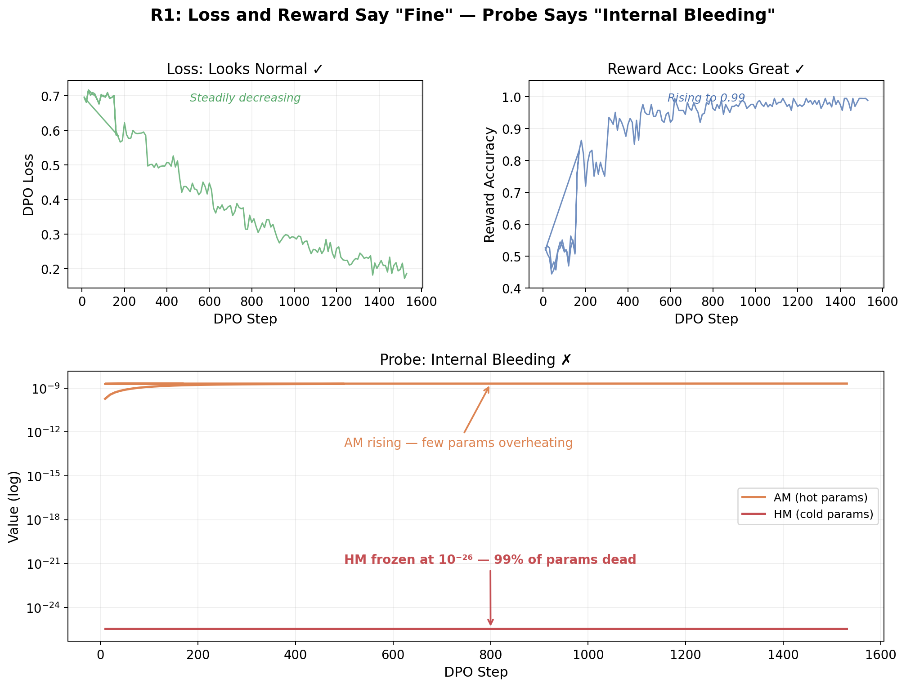
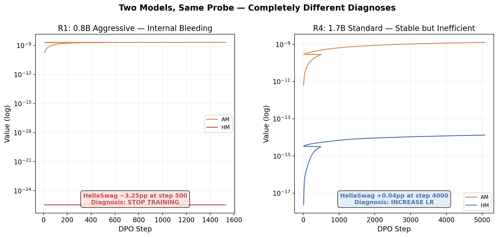

<p align="center">
  <h1 align="center">Covec Pulse</h1>
  <p align="center"><b>Loss Knows Last.</b><br/>
  Training health diagnostics from optimizer state.</p>
</p>

<p align="center">
  <a href="https://github.com/Wha1eChai/covec-pulse/blob/master/LICENSE"></a>
  
  
</p>

<p align="center">
  <a href="#quick-start">Quick Start</a> &middot;
  <a href="#what-it-detects">What It Detects</a> &middot;
  <a href="#api">API</a> &middot;
  <a href="#looking-for-partners--寻找合作伙伴">Partners</a> &middot;
  <a href="#中文说明">中文</a>
</p>

---

Pulse reads Adam's second moments (`exp_avg_sq`) during fine-tuning and computes the **HM/AM ratio** — a real-time signal of parameter space health. When the ratio crashes, your model is silently losing pretrained capabilities, even if loss looks perfectly normal.

**Zero model changes. Zero extra GPU. Zero weight upload. One callback.**

## Why?

Your DPO loss is decreasing. Reward accuracy is 0.99. Everything looks great.

But 500 steps later, HellaSwag drops 3.25 percentage points. Your model forgot common sense while learning preferences.

**Loss was the last to know. The optimizer knew from step one.**

<p align="center">
  
</p>

## Quick Start

```python
from covec_pulse import PulseCallback

trainer = DPOTrainer(model=model, args=args, ...)
trainer.add_callback(PulseCallback(log_every=50))
trainer.train()
# Check pulse_outputs/pulse_probe.jsonl
```

That's it. No config, no API keys, no data upload.

## What It Detects

| Signal | What It Means | Action |
| ------ | ------------- | ------ |
| AM rising, HM frozen (HM/AM crashes) | Few params overheating, most params silent — hidden capability loss | Reduce LR or stop training |
| HM and AM both rising, ratio stable or increasing | Gradient signal reaching all params | Check reward accuracy — if too low, increase LR |

<p align="center">
  
</p>

## Install

```bash
pip install git+https://github.com/Wha1eChai/covec-pulse.git
```

Requires Python >= 3.10, PyTorch >= 2.0, Transformers >= 4.36.

## Diagnose an Existing Checkpoint

Already have a checkpoint from a previous training run? No need to retrain:

```bash
pulse diagnose path/to/checkpoint-500
```

```
Covec Pulse — Checkpoint Diagnosis
========================================
Params analyzed:  498,057,216
Tensors matched:  204
AM:               2.0291e-09
HM:               3.4607e-26
HM/AM ratio:      1.7055e-17

DIAGNOSIS: CRITICAL
  HM/AM ratio near zero — most parameters are silent.
  This model is likely suffering from severe capability loss.
```

Or in Python:

```python
from covec_pulse import diagnose_checkpoint

snapshot = diagnose_checkpoint("path/to/checkpoint-500")
print(f"HM/AM = {snapshot.hm_am_ratio:.4e}")
```

**Want us to diagnose your checkpoint?** Run `pulse diagnose --json` locally, send us the output JSON (no weights leave your machine), and we'll give you a full analysis. See [Partners](#looking-for-partners--寻找合作伙伴).

## API

### High-Level: HuggingFace Callback

```python
from covec_pulse import PulseCallback

callback = PulseCallback(
    log_every=50,           # probe interval (steps)
    output_dir="pulse_outputs",
)
trainer.add_callback(callback)
```

### Low-Level: Any Training Loop

```python
from covec_pulse import probe_optimizer

snapshot = probe_optimizer(optimizer, step=current_step)
print(f"HM/AM = {snapshot.hm_am_ratio:.4e}")
```

### Read Results

```python
from covec_pulse.io import read_probe_jsonl, summary

records = read_probe_jsonl("pulse_outputs/pulse_probe.jsonl")
stats = summary(records)
print(stats["hm_am_trend"])  # "declining" or "stable"
```

## Compatibility

| Framework | Status |
| --------- | ------ |
| HuggingFace Trainer | Supported |
| TRL (DPOTrainer, SFTTrainer) | Supported |
| Any Adam/AdamW training loop | Supported via `probe_optimizer()` |
| Unsloth | Compatible (HF Trainer internally) |
| LLaMA-Factory | Compatible (HF Trainer internally) |

## How It Works

Adam maintains `exp_avg_sq` — a running average of squared gradients for every parameter. Pulse computes:
- **AM** (arithmetic mean): dominated by the hottest params
- **HM** (harmonic mean): dominated by the coldest params
- **HM/AM ratio**: when this crashes, most params have gone silent while a few are overheating

All computation on CPU, float64 precision. Training speed impact: < 0.1%.

---

## 中文说明

### Loss Knows Last — 从优化器内部状态实时探测训练健康

Pulse 从 Adam 优化器的内部状态（`exp_avg_sq`）中读取训练健康信号。当你的 loss 还在正常下降的时候，Pulse 已经能看到模型是否在丢失预训练能力。

### 用法

```python
from covec_pulse import PulseCallback

trainer = DPOTrainer(model=model, args=args, ...)
trainer.add_callback(PulseCallback(log_every=50))
trainer.train()
```

输出：`pulse_outputs/pulse_probe.jsonl`，每个探测步一条记录。

### 信号解读

| 信号 | 含义 | 建议 |
| ---- | ---- | ---- |
| AM 上升、HM 冻结（HM/AM 崩塌） | 少数参数过热，多数参数沉寂——隐性能力损失 | 降低学习率或停训 |
| HM 和 AM 同步上升，比值稳定或上升 | 梯度信号到达所有参数 | 检查 reward accuracy——如果太低说明 LR 不够 |

### 核心优势

- **零侵入**：不改模型、不改训练代码、不上传权重
- **零成本**：不额外占用 GPU，对训练速度影响 < 0.1%
- **先于 Loss**：Loss 是最后一个知道的，优化器从第一步就知道

---

## Looking for Partners / 寻找合作伙伴

**Validation partners / 场景验证**：Teams doing DPO/SFT/GRPO fine-tuning who want to try Pulse on real training runs. We provide diagnostic analysis, you provide real-world feedback. / 如果你的团队在做微调，我们希望接入你的真实训练流程，一起验证诊断效果。

**Compute partners / 算力合作**：Help us validate Pulse across more model scales (7B–70B) and training methods. / 我们的诊断引擎需要在更多模型规模和训练方法上验证，欢迎算力合作。

- WeChat: `Whale_ora`
- Email: whaleora@gmail.com

## License

Apache-2.0 — see [LICENSE](LICENSE).

## About

Built by [Covec](https://github.com/Wha1eChai).
